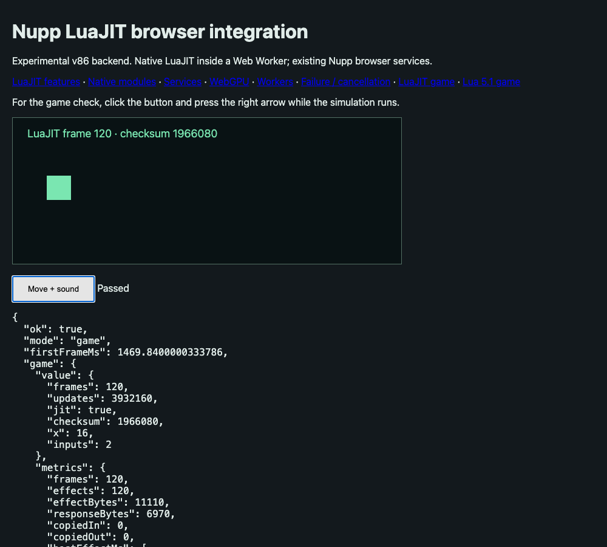

# LuaJIT in the browser through v86

**Branch-only experiment. Do not merge this branch into main.**

The route works: Nupp's existing `luajit` output runs under the unmodified,
pinned LuaJIT inside v86, including actual JIT-generated x86 machine code,
FFI, `string.buffer`, and the pinned syntax extensions. The browser integration
fixtures pass. This is evidence for a LuaJIT-only Nupp runtime strategy, not a
production backend or proof that every program, browser, and native library works.

The experiment deliberately starts from the preserved QEMU spike commit
`c839466f1fc05292a3ebb414a2dd0c1476ffbc09` so both emulator experiments reuse
the same compiler, workloads, browser handlers, and independent result checks.
The original QEMU additions were reverted from main in `53e2ad45`.
No production compiler or runtime files are changed here.

## Results

See [paired measurements](results/comparison/summary.json),
[conformance results](results/conformance/summary.json),
[asset inventory](results/assets.json), and [provenance](results/provenance.json).
Measurements use fresh Chrome 152 launches on an Apple M5 Pro/macOS 26.6,
localhost delivery, and a fixed 1000 × 900 viewport. They exclude remote
download latency and make no general application speedup claim.

The game comparison uses the same Nupp simulation in both backends: 120 frames,
32,768 FFI-backed struct updates per LuaJIT frame, equivalent portable struct
updates under Lua 5.1, the same Canvas handler, actual mouse/keyboard input,
AudioContext activation, and offline audio sample checks. Three alternating
pairs are recorded; the warm metric discards the first 30 frame intervals.

| Median across three runs | v86 / LuaJIT | Lua 5.1 / Wasm |
| --- | ---: | ---: |
| First rendered frame | 1,328 ms | 51.8 ms |
| Overall frame rate | 55.7 FPS | 44.3 FPS |
| Warm frame rate | 60.0 FPS | 46.9 FPS |
| Median frame interval | 16.67 ms | 21.26 ms |
| 95th-percentile frame interval | 19.25 ms | 22.66 ms |

For this fixture that is approximately 26% higher overall frame rate and 28%
higher warm frame rate, with approximately 26 times the startup latency. The
warm LuaJIT result reaches the fixture's 60 Hz animation cadence.

The game startup assets total **14,621,849 bytes (13.94 MiB)** before HTTP
content encoding, including the already compressed guest initramfs. The
emulator core is 2,101,621 bytes; the Linux kernel is 10,068,480 bytes and
dominates the download. The fallback core is staged but excluded from this
tested startup set. Each VM allocates approximately **269 MiB of Wasm memory**;
that excludes browser/JS memory, compiled code, and GPU allocations. Workers
each need their own VM. These are allocations, not resident-process measurements.

For context, the earlier QEMU fixture recorded a 7.71-second first frame,
51.9 FPS overall, 60.0 FPS warm, approximately 53 MiB of application assets,
and 2,300 MiB of configured Wasm memory per VM. Those are earlier measurements,
not a simultaneous three-backend comparison.



## What passed

| Boundary | Exercised behavior |
| --- | --- |
| LuaJIT | Real trace machine code; JIT on/off results agree; Nupp FFI structs |
| Syntax | `const`, bit/logical/compound/ternary operators, safe navigation, `??`, `continue`, digit separators |
| FFI | Arrays, pointers, exact int64 arithmetic, libc, C varargs, dynamic shared libraries, C/Lua callbacks |
| Runtime libraries | `bit`, `string.buffer`, reserve/commit, encode/decode, LuaJIT helper modules |
| Native modules | LPeg 1.1.0, Nupp-generated C kernel through FFI, dynamic compilation, bytecode reload, yield through `pcall` |
| Host memory | Binary pointer transfers/copyback, retained allocations, stale/read-only/invalid-size rejection and release |
| Browser services | Clocks, timers, entropy, crypto known answers, platform metadata, HTTP binary upload/readback/limits/timeouts |
| Persistence | IndexedDB including NUL/Unicode, data survives destroying and restarting the guest |
| GPU | Existing browser WebGPU handlers, generated WGSL, resident buffers and 1,024 checked readback values |
| Workers | Two independent guests, copied records, fan-out, empty returns, errors, queue bounds, cancellation, deadlines |
| Lifecycle | Guest errors propagate; CPU-bound guest cancellation and host timeouts work |
| Interaction | Simulation checksum, rendered Canvas pixel, actual mouse/key events and audio activation/sample checks |

These are the enumerated fixtures, not the entire LuaJIT or Nupp test suites.
The CPU-loop feature timings compare JIT on/off **within v86**, not v86 against
Lua 5.1. The paired frame experiment is the comparison against Lua 5.1.

## How it works

v86 0.5.461 translates x86 machine code into Wasm at runtime. LuaJIT therefore
keeps its existing interpreter, recorder, optimizer, assembler, and FFI.
v86 has no x86-64 support, so the guest is Linux i386 with 32-bit pointers.
64-bit integer cdata still works. Native dependencies must be Linux i386
libraries; a host macOS/Windows/x86-64 library is not directly usable.

The guest build uses Apple clang's i386 cross target, Alpine's musl sysroot,
and LLVM's linker. LuaJIT's `buildvm` needs 32-bit pointers, so **only this build
helper** is compiled to Wasm32 using Emscripten and executed in Node. The
delivered LuaJIT executable is ordinary native i386 Linux code. No LuaJIT source
patches are applied. Matching host LuaJIT precompiles the application with
`loadfile(..., "tW")` and `string.dump(..., "sd")` for its non-GC64 guest format.

The 256 MiB guest reserves 64 MiB for the existing bounded mailbox protocol.
v86's physical-memory API reads/writes that mailbox. Serial messages announce
requests and acknowledge replies; the host reuses Nupp's existing browser
effect handlers. The app/config and fresh entropy arrive in an initramfs
overlay, so no guest networking or 9p filesystem is required. Negative transfer
checks reuse the QEMU spike's validation fixtures.

The parent publishes a monotonic clock into an 8-byte SharedArrayBuffer.
The emulator worker copies it into guest RAM between v86 execution slices.
A single i386 `fldl` reads the guest double without a torn pair of word loads.
The isolated deadline fixture verifies cancellation within its 2-second bound.
The current adapter consequently requires COOP/COEP and SharedArrayBuffer.

Browser services remain necessary. A LuaJIT-only policy could remove the
portable language lowering and old-LuaJIT compatibility lowering, but does
not remove browser I/O adapters or the native dependency packaging problem.
It would also stop supporting hosts that embed an older LuaJIT unless those
hosts update. No dialect is removed by this spike.

## Reproduce

Use this branch on macOS with Apple clang, Node, Python >= 3.10, and
Emscripten 6.0.8. No Docker or guest compiler is needed. Tools may need writable
Emscripten caches. Downloads are SHA-256 pinned in `assets.lock.json`.

```sh
/opt/homebrew/bin/python3 bench/v86-spike/prepare.py
# Use the repository's pinned Lua 5.1.5 source directory:
/opt/homebrew/bin/python3 bench/v86-spike/prepare-portable.py /private/tmp/nupp-portable-compiler/lua-5.1.5/src
node bench/qemu-wasm-spike/serve.mjs build/v86-spike/web 8099
```

With the server running, execute sequentially from another terminal:

```sh
node bench/v86-spike/conformance.mjs
node bench/v86-spike/compare.mjs
/opt/homebrew/bin/python3 bench/v86-spike/record-results.py
```

Open `http://127.0.0.1:8099/integration.html?mode=game` for the interactive
fixture. `CHROME` can override the browser executable. Generated artifacts
stay under ignored `build/v86-spike`; the portable builder uses its original
ignored `build/qemu-wasm-spike` output and copies the three required files.
`boot-node.mjs` is a verbose guest diagnostic, not the browser proof.

## Smaller guest follow-up

The original 256 MiB setting was a configuration choice. A separate memory
probe now tests smaller guests without changing that baseline:

| Workload | Configured guest RAM | Observed Wasm memory | Outcome |
| --- | ---: | ---: | --- |
| Native libraries and interactive game | 64 MiB | about 77 MiB | Passed |
| Load the current playground compiler | 64 MiB | — | Linux killed LuaJIT for running out of memory |
| Basic playground compiler requests, three rounds | 128 MiB | about 142 MiB | Passed |

Raw results and exact artifact hashes are in [results/memory](results/memory).
The compiler case uses the actual 7.37 MB portable playground compiler bundle,
cross-compiled to 6.40 MB of non-GC64 LuaJIT bytecode. It checks typed source,
hover, optimized Lua 5.1 output, and LuaJIT literal output using cases from
`tests/portable-compiler/smoke.lua`. It executes in the same pinned LuaJIT as
the runtime. This does not implement the playground UI on v86 or establish a
memory bound for arbitrary programs. The optional full corpus, including
larger standard-library imports, exceeded the exploratory time limit at
128 MiB; the passing result is explicitly the basic request subset.

The [compiler and delivery follow-up](PERFORMANCE.md) diagnoses that timeout:
the portable bundle selected scalar bit operations. Native bit operations and
JIT-off compiler execution now pass the full smoke corpus at 128 MiB, with
direct measurements against the existing Lua 5.1 Wasm host. It also measures
HTTP delivery and a diagnostic kernel without the unrelated embedded filesystem.

The [startup follow-up](STARTUP.md) measures parallel asset loading and a reusable
snapshot captured before LuaJIT starts, including cold and cached browser visits.

The small profiles reserve an 8 MiB mailbox, with 1 MiB JSON slots and 2 MiB
binary-transfer slots. Linux gets 48 MiB in the 64 MiB guest and 112 MiB in the
128 MiB guest. The pinned v86 JavaScript loader is patched at one checked
location to place the initrd at 32 MiB, below its original 64 MiB address.
LuaJIT and the emulator Wasm core remain unchanged. Linux uses `rootfstype=ramfs`
to avoid the default tmpfs limit preventing image unpacking at 64 MiB; this
does not increase the guest's RAM budget. The 64 MiB compiler OOM occurs after
that boot issue is resolved.

Thus **64 MiB runner / 128 MiB compiler** is a tested starting configuration,
not a proven minimum or an arbitrary-source guarantee. Separate compiler and
runner VMs would allocate roughly 219 MiB of Wasm memory together, plus other
browser overhead. A smaller kernel/root filesystem and compiler packaging
could change those budgets; those optimizations remain unmeasured.

Reproduce after the ordinary spike preparation:

```sh
./scripts/prelude-image
/opt/homebrew/bin/python3 bench/v86-spike/prepare-memory.py 64
/opt/homebrew/bin/python3 bench/v86-spike/prepare-memory.py 128
/opt/homebrew/bin/python3 bench/v86-spike/prepare-memory.py 64 --runtime-only
```

Serve the three generated directories in separate terminals:

```sh
node bench/qemu-wasm-spike/serve.mjs build/v86-spike/memory-64/web 8099
node bench/qemu-wasm-spike/serve.mjs build/v86-spike/memory-128/web 8100
node bench/qemu-wasm-spike/serve.mjs build/v86-spike/memory-64-runtime/web 8101
```

Then run `node bench/v86-spike/probe-memory.mjs`. It requires both application
tests and the 128 MiB compiler test to pass, and the 64 MiB compiler case to
fail specifically with a guest OOM. It writes its evidence under ignored
`build/v86-spike/memory-results`. Add `--full-corpus` to the preparation command
to reproduce the larger compiler workload separately.

The kernel documents the root filesystem choice in
[ramfs/rootfs/initramfs](https://docs.kernel.org/filesystems/ramfs-rootfs-initramfs.html).

## Remaining limits

Chrome/macOS is the tested browser/host combination. Safari, Firefox, mobile
memory pressure, CSP deployment, remote download latency, long-running workloads,
and larger native dependency sets are unmeasured. Startup is still much slower
than the small Lua 5.1 Wasm host. Snapshots, a smaller custom kernel, shared
resource caching, and memory tuning were not part of the original baseline;
the linked follow-up measures compression/caching and an empty-filesystem kernel
repack, but not a source-built minimal kernel or snapshots.

The emulator has a permissive [BSD-2-Clause license](https://github.com/copy/v86/blob/master/LICENSE),
but this Linux/BusyBox/BIOS guest is **not an entirely permissive stack**.
Guest-component licenses and corresponding-source obligations still need to
be handled for an actual binary distribution. The branch retains build scripts,
download pins, results, and the emulator/LuaJIT/LPeg notices locally; it does
not publish the downloaded VM binaries or claim to supply a complete guest
redistribution compliance bundle.

Upstream references: [v86 architecture and limits](https://github.com/copy/v86),
[LuaJIT bytecode cross-compilation](https://luajit.org/extensions.html#load_mode),
and [the pinned LuaJIT syntax documentation](https://github.com/LuaJIT/LuaJIT/blob/1edc3e52b67eaf6ce5f809be8e17d6862594b8bc/doc/extensions.html).
